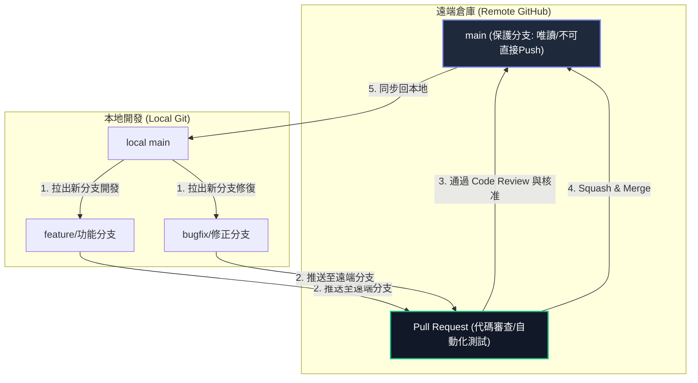

# DE Multi-Track Stego Player & Packer Suite
## 基於無損預測誤差擴張 (PEE) 的多音軌影音隱寫播放與封裝套件

本專案是一套融合 **資訊安全 (Information Security)**、**數位取證 (Digital Forensics)** 與 **可逆資料隱寫 (Reversible Data Hiding, RDH)** 技術的影音藏密封裝與解碼播放軟體套件。

系統採用 **Coltuc 低失真預測誤差擴張變換 (Low-Distortion Transform for PEE, IEEE TIP 2012)** 演算法，能將多個獨立的二進制載荷（如多語系配音檔、機密會議錄音、版權中繼資料）無損且隱蔽地隱寫在單一 H.265 (HEVC) 影片的像素預測誤差中。核心採用 **JPEG4 預測器 (x̂ = n + w − nw)**，並將擴張後的預測誤差「四等分散」到不相交 2×2 區塊的整個預測脈絡上，使單位元嵌入的方均失真由傳統 PEE 的 ~p² 降至 ~p²/4，且**每像素灰階變動嚴格 ≤ ±1**。在播放時，系統透過 JIT 加速解密管道，於背景即時自影像幀中提取隱藏資料並無感還原為多軌音訊進行同步播放，同時實現影片載體畫面的 **100% 位元級完美還原 (Bit-Perfect Reversibility，MD5/SHA256 校驗完全吻合)**。

> 📄 **演算法參考文獻**：D. Coltuc, *"Low Distortion Transform for Reversible Watermarking,"* IEEE Transactions on Image Processing, vol. 21, no. 1, pp. 412–417, Jan. 2012.

---

## 🚀 專案核心技術優勢 (Technical Advantages)

本套件相較於傳統數位浮水印或損毀式（LSB）密寫，具備以下決定性的核心優勢：

### 1. 醫療與司法鑑定級的「完全可逆還原性 (Reversible Data Hiding)」
*   **傳統密寫缺點**：傳統的 LSB（最低有效位元）或空域隱寫法會永久性地修改並損毀原始影片的像素值，導致載體畫質受損且無法逆向復原。
*   **本系統優勢**：本套件利用 PEE 可逆演算法，當解密端完整提取出隱密音軌後，能藉由逆向數學公式將修改後的預測誤差還原為原始誤差，從而將影片幀像素還原至與原始影片 **100% 完全相同（位元級 byte-by-byte 一致，MD5/SHA256 校驗值完全吻合）**。這使得本系統非常適用於對原始影像數據精確度要求極高（如醫療影像診斷、軍事地圖、司法取證）的敏感領域。

### 2. 極致的視覺隱蔽性 (Imperceptibility)
*   **JPEG4 預測 + 脈絡分散**：演算法不對像素原值直接修改，而是以 JPEG4 預測器（北 n + 西 w − 西北 nw）計算當前像素與預測值的差值（預測誤差）。由於相鄰像素具備高度相關性，預測誤差極度集中在 0 附近。
*   **四等分散最小化失真**：傳統 PEE 把整個擴張誤差堆在單一像素（失真 ~$p^2$）；本系統依 Coltuc 變換將其**四等分散到不相交 2×2 區塊的 4 個脈絡像素**（失真降至 ~$p^2/4$），且每像素灰階變動**嚴格 $\le \pm 1$**（傳統平移法為 $\pm 2$）。
*   **超高畫質指標**：實測密寫影片的峰值信噪比（PSNR）在高負載（~0.27 bpp）下仍達 **$55\text{ dB}$ 以上**（相同 payload 較傳統北向 PEE 提升約 +4~5 dB），結構相似性（SSIM）無限接近於 `1.0`。在視覺上完全沒有雪花雜訊、色彩斷層或摩爾紋，肉眼完全不可察覺。
*   **確定性 location map**：以保留列像素的 LSB 旁通道存放壓縮後的 skip-map，讓解碼端可逐塊『確定性』判定 process/skip，徹底消除盲偵測在 0/255 邊界區塊的歧義，保證 100% 位元級可逆。

### 3. Numba JIT 加速與高效 YUV 串流管線 (High-Performance JIT Engine)
*   **計算性能優化**：Python 原生遍歷百萬級像素速度極慢。本系統使用 **Numba JIT 靜態編譯技術**，將核心隱寫與提取演算法編譯為機器碼執行（達到 C 語言級運行效率），並與 FFmpeg 串流管道對接，大幅降低 CPU 計算開銷。
*   **異步解密機制**：播放器載入影片時，會啟動獨立的背景執行緒 (QThread) 進行像素掃描、資料提取與 zlib 解壓縮。這項異步處理機制能確保在後台高效完成音軌還原與解密封裝，同時保證播放器介面 (UI) 的流暢度，避免主執行緒卡頓。

### 4. 偽裝與社交平台傳輸相容性 (Stealth & Compatibility)
*   **標準封裝相容**：輸出的密寫影片採用標準 H.265 (hvc1) MP4 格式，可在常規雲端硬碟（Google Drive、Dropbox）上正常上傳與預覽，並可使用常規播放器（如 VLC、Windows Media Player、Chrome 瀏覽器）正常播放（此時僅會播放預設的單一音軌）。
*   **隱蔽安全**：在常規播放器下，這 5~10 個隱藏的多國語言音軌是完全隱形且不可檢測的，只有在本套件的 StegoPlayer 中才能被識別並完美提取播放，極具隱蔽性。

---

## 🎯 應用場景 (Application Scenarios)

*   **機密錄音與敏感檔案保護**：將高度機密的通話、會議錄音無損藏入一部看似普通的家庭短片中進行傳輸。
*   **多語系影片隱蔽發布**：將多種敏感配音（如非官方多國配音）安全嵌入單一影片像素中，防範被串流平台屏蔽或音軌分離。
*   **司法防偽與影像取證 (Watermarking)**：在影像中潛伏高容量的版權與雜湊資訊，在不破壞原圖畫質的前提下進行版權溯源，需要時可完全還原出原圖。

---

## 📂 專案目錄架構

為了保持版本控制代碼的潔淨，專案只保留核心功能程式碼與建置腳本。其餘本地測試所需的大型測試影片與暫存檔案皆已配置於 `.gitignore` 排除，不納入代碼庫中。

```
DE/
├── src/                        # 核心功能程式碼
│   ├── download_app.py         # MultiAudioDownloader (多音軌多語系影片下載 GUI)
│   ├── embed_app.py            # StegoPacker (多音軌 PEE 隱寫封裝 GUI)
│   ├── player_app.py           # StegoPlayer (即時解密多音軌播放器 GUI，含科技感儀表板)
│   ├── pee_stego.py            # PEE Steganography 核心演算法庫 (Numba 加速)
│   └── pyinstaller_utils.py    # PyInstaller 打包路徑與可移植性工具
│
├── MultiAudioDownloader.spec   # 多音軌下載器的 PyInstaller 打包設定檔
├── StegoPacker.spec            # 封裝器的 PyInstaller 打包設定檔
├── StegoPlayer.spec            # 播放器的 PyInstaller 打包設定檔
├── build.bat                   # Windows 平台下一鍵打包 Executable 執行檔腳本
├── requirements.txt            # 專案依賴套件清單
├── .gitignore                  # Git 排除清單 (防止大型影片與編譯快取上傳)
└── README.md                   # 專案說明文件 (本檔案)
```

---

## 🔄 Coltuc 低失真變換 藏密與解密核心原理流程圖

以下為本專案核心演算法 **Coltuc 低失真 PEE 變換 (IEEE TIP 2012)** 的詳細藏密（嵌入）與解密（還原）運作邏輯。演算法以**不相交 2×2 區塊**為單位，區塊內布局為：左上 `nw`、右上 `n`、左下 `w`、右下 `x`（當前像素）。

```mermaid
flowchart TD
    %% Define Styles
    classDef embed fill:#064e3b,stroke:#34d399,stroke-width:1px,color:#fff;
    classDef extract fill:#581c87,stroke:#c084fc,stroke-width:1px,color:#fff;
    classDef decision fill:#1e293b,stroke:#475569,stroke-width:1px,color:#fff;
    classDef math fill:#0f172a,stroke:#38bdf8,stroke-width:1px,color:#fff;

    subgraph Embedding ["左：Coltuc 藏密嵌入原理 (Embedding Process)"]
        E_Start(["取一個不相交 2×2 區塊：nw, n, w, x"])
        E_CheckBound{"process band 檢查：
        nw, n, w, x 皆 ∈ [2, 245] ?"}
        E_SkipBound["跳過 (記入 skip-map)，
        區塊保持原值"]
        E_Predict["JPEG4 預測：x̂ = n + w − nw
        預測誤差 p = x − x̂"]

        E_CheckRange{"判斷預測誤差 p 的區間"}

        E_Range_Expand["可嵌入區間：−1 ≤ p ≤ 1"]
        E_ReadBit["讀取 1 bit 秘密資料 b"]
        E_CalcExpand["擴張：P = 2p + b"]

        E_Range_Shift_Pos["p > 1"]
        E_Shift_Pos["平移避讓：P = p + 2"]
        E_Range_Shift_Neg["p < −1"]
        E_Shift_Neg["平移避讓：P = p − 2"]

        E_Distribute["四等分散 (式4)：Δ = P − p
        u_x=⌊Δ/4⌋, u_w=⌊(Δ+1)/4⌋,
        u_nw=⌊(Δ+2)/4⌋, u_n=⌊(Δ+3)/4⌋"]
        E_WriteBlock["寫回 2×2 脈絡 (式5)：
        X=x+u_x, N=n−u_n,
        W=w−u_w, NW=nw+u_nw
        (每像素變動 ≤ ±1，絕不溢位)"]
        E_End(["輸出 Stego 隱寫幀 + 壓縮 skip-map (LSB 旁通道)"])
    end
    class E_Start,E_Predict,E_SkipBound,E_Range_Expand,E_ReadBit,E_CalcExpand,E_Range_Shift_Pos,E_Shift_Pos,E_Range_Shift_Neg,E_Shift_Neg,E_Distribute,E_WriteBlock,E_End embed;
    class E_CheckBound,E_CheckRange decision;

    subgraph Extraction ["右：解密與無損還原原理 (Extraction & Restoration)"]
        X_Start(["讀 LSB 旁通道還原 skip-map，逐塊掃描 marked 區塊 X,N,W,NW"])
        X_CheckSkip{"skip-map 標示本塊為跳過？"}
        X_SkipBound["跳過不處理，區塊保持原值"]
        X_Predict["以 marked 脈絡重算預測 (式6)：
        x̂_X = N + W − NW
        含密誤差 P = X − x̂_X (= 2p + b)"]

        X_CheckEmbed{"P 是否落在 [−2, 3] ?"}
        X_GetBit["提取秘密位元 b = LSB(P)，
        並還原 p = ⌊P/2⌋"]
        X_No_Data["平移塊：
        P≥4 → p=P−2；P≤−4 → p=P+2"]

        X_Distribute["重算 Δ = P − p 與四等分 u (式4)"]
        X_RecoverBlock["逆變換還原原始脈絡 (式9)：
        x=X−u_x, n=N+u_n,
        w=W+u_w, nw=NW−u_nw"]
        X_End(["100% 位元還原原始載體幀 (MD5 吻合)"])
    end
    class X_Start,X_Predict,X_SkipBound,X_GetBit,X_No_Data,X_Distribute,X_RecoverBlock,X_End extract;
    class X_CheckSkip,X_CheckEmbed decision;

    %% 關聯線段
    E_Start --> E_CheckBound
    E_CheckBound -->|否| E_SkipBound
    E_CheckBound -->|是| E_Predict
    E_Predict --> E_CheckRange
    E_CheckRange --> E_Range_Expand
    E_Range_Expand --> E_ReadBit --> E_CalcExpand --> E_Distribute
    E_CheckRange --> E_Range_Shift_Pos --> E_Shift_Pos --> E_Distribute
    E_CheckRange --> E_Range_Shift_Neg --> E_Shift_Neg --> E_Distribute
    E_Distribute --> E_WriteBlock --> E_End

    X_Start --> X_CheckSkip
    X_CheckSkip -->|是| X_SkipBound
    X_CheckSkip -->|否| X_Predict
    X_Predict --> X_CheckEmbed
    X_CheckEmbed -->|是| X_GetBit --> X_Distribute
    X_CheckEmbed -->|否| X_No_Data --> X_Distribute
    X_Distribute --> X_RecoverBlock --> X_End

    %% 跨欄關聯 (說明可逆性)
    E_End -.->|密寫影片傳輸| X_Start
```




---

## 🛠️ 開發環境建置

### 1. 安裝 Python 依賴
本專案開發測試基於 **Python 3.10+** (推薦使用 3.11 或 3.12)。請在您的虛擬環境下執行：
```bash
pip install -r requirements.txt
```

### 2. 執行應用程式
*   **啟動下載器**：`python src/download_app.py`
*   **啟動封裝器**：`python src/embed_app.py`
*   **啟動播放器**：`python src/player_app.py`

---

## 📝 專案開發規範

為確保專案程式碼的質量與多人口維護的流暢度，請所有編輯者遵守以下規範：

### 1. 程式碼風格與註解
*   遵循 **PEP 8** 程式碼風格指南。
*   所有底層影像與矩陣運算必須使用 **Numba JIT (`@njit(nogil=True, cache=True)`)** 進行加速，並確保傳入的矩陣類型與形狀（如 `np.int16`, `np.uint8`）定義明確，避免 JIT 編譯失敗。
*   **嚴禁刪除任何現有註解或文件**，修改現有代碼時，必須完整保留與該更動無關的既有註解。

### 2. 檔案管理規範 (防範爆庫)
*   **嚴禁提交大型影音檔案與編譯產物**：本系統測試用的影片動輒數 GB，GitHub 限制單一檔案不得超過 100MB。任何影片格式（如 `.mp4`, `.webm`, `.mkv`）、壓縮包（`.zip`）以及編譯快取與產物（`build/`, `dist/`, `.numba_cache/`）皆已在 `.gitignore` 中過濾，切勿強行提交。
*   任何個人實驗性、測試性的臨時腳本，請勿加入 Git 版本控制中。

---

## 🌿 Git 分支與 Push 合併規則 (主線保護機制)

為確保 `main` 主線分支的穩定性，防止未經驗證的代碼被隨意合併導致系統崩潰，本專案在 GitHub 上實施嚴格的**主線保護機制**與**分支工作流**。

### 1. Git 分支與 PR 流程圖



### 2. 分支命名與用途規範

*   **`main` 分支**：生產與發布的主線分支。僅接受通過審查的 Pull Request 合併，**嚴禁任何開發者直接 Push 至此分支**。
*   **`feature/*` 分支**：新功能開發分支。命名範例：`feature/extract-dashboard`、`feature/compatibility-patch`。
*   **`bugfix/*` 分支**：Bug 修復分支。命名範例：`bugfix/ffmpeg-crash-fix`、`bugfix/sync-drift`。

### 3. Commit Message 格式規範 (Angular 規範)

為便於版本歷史追踪與自動化日誌生成，Commit 說明必須採用以下格式：
`類型(影響範圍): 簡短描述`

*   `feat`: 新增功能 (例如 `feat(player): add tech-style real-time log terminal`)
*   `fix`: 修復錯誤 (例如 `fix(stego): fix uint8 luma overflow during expansion`)
*   `docs`: 文件異動 (例如 `docs(readme): detailed code review specs`)
*   `style`: 代碼格式調整 (不影響邏輯，例如 `style(player): reformat PySide layout margins`)
*   `refactor`: 重構代碼 (例如 `refactor(utils): simplify path resolution logic`)
*   `perf`: 效能優化 (例如 `perf(numba): pre-allocate extraction bit buffer`)

---

## 🔍 Pull Request & Code Review 審查細則

所有合併至 `main` 分支的 PR，審查者 (Reviewer) 必須針對以下細節進行嚴格審查：

### 1. Coltuc 變換安全性與可逆性審查
*   **防溢位轉型**：在計算 JPEG4 預測誤差 $p = x - \hat{x}$ 前，必須確認 Y 平面已轉型為 `np.int16`，嚴禁使用 `np.uint8` 直接運算，避免負數溢位。
*   **process band 保證 (取代 Clipping)**：Coltuc 變換僅在 2×2 區塊四像素皆 ∈ `[2, 253]` 時嵌入，數學上保證每像素變動 $\le \pm 1$、結果恆在 $0 \sim 253$，故**毋需也嚴禁使用 `np.clip`**（clip 會破壞可逆性）。
*   **skip-map 一致性**：嵌入與解碼端的 `coltuc_classify_numba` 區塊判定須完全一致；保留列 LSB 旁通道存放的壓縮 skip-map 必須能被解碼端確定性還原，否則破壞位元級可逆。
*   **逆向無損驗證**：任何修改演算法邏輯的變更，必須在本地使用 MD5 驗證原始影片與提取還原後的影片是否 100% 相同。

### 2. 效能與資源管理審查
*   **Numba 靜態加速**：確保所有核心的影像逐區塊遍歷函數（如 `coltuc_embed_core_numba`、`coltuc_extract_restore_core_numba`、`coltuc_classify_numba`）皆有 `@njit(nogil=True, cache=True)` 裝飾器，且未調用無法被 Numba 編譯的 Python 原生 API。
*   **執行緒隔離**：耗時的 FFmpeg 解碼與隱寫資料提取操作，必須運行在 `QThread` 之中，**嚴禁**在 PySide6 的 GUI 主執行緒中執行阻塞性高的運算，避免介面卡死。
*   **暫存目錄清理**：程序結束或切換影片時，必須觸發 `cleanup_temp_dir()` 釋放寫入作業系統臨時目錄下的 AAC 音軌暫存檔，防止開發者的硬碟空間被暫存檔塞滿。

---

## 🔒 GitHub 倉庫分支保護設定指南 (管理員必讀)

專案管理員請依照以下步驟設定 GitHub，以強制啟用上述保護規範：

1.  進入 GitHub 專案首頁，點擊右上角 **⚙️ Settings**。
2.  在左側選單點擊 **Branches**。
3.  在 *Branch protection rules* 下，點擊 **Add branch rule**。
4.  在 *Branch name pattern* 輸入 `main`。
5.  勾選 **Require a pull request before merging**：
    *   將 **Require approvals** 設定為 `1`（需要至少一人審查通過）。
    *   勾選 **Dismiss stale pull request approvals when new commits are pushed**（有新 Commit 時自動重置 Approve 狀態）。
6.  勾選 **Require conversation resolution before merging**（必須解決所有程式碼討論留言才能合併）。
7.  勾選 **Do not allow bypassing the above settings** (或 **Include administrators**)。
    *   *註：這點最關鍵，它能防止專案擁有者不小心繞過 PR 機制直接 Push 主線。*
8.  點擊下方 **Create** 保存規則。