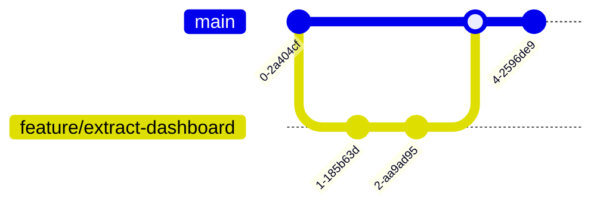

# DE Multi-Track Stego Player & Packer Suite
## 基於無損預測誤差擴張 (PEE) 的多音軌影音隱寫播放與封裝套件

本專案是一套基於 **可逆資料隱寫 (Reversible Data Hiding, RDH)** 與 **預測誤差擴張 (Prediction Error Expansion, PEE)** 技術的數位藏密軟體套件。系統能夠將多個獨立的音訊軌道（如多國語系配音）無損地隱藏在單一 H.265 (HEVC) 影片的像素預測誤差中。播放時，系統利用 Numba JIT 加速引擎即時自影像幀中提取音軌並進行多聲道同步播放，同時實現影片畫面的 **100% 位元級完美還原 (Bit-Perfect Reversibility)**。

---

## 📂 專案目錄架構

為了保持版本控制代碼的潔淨，專案只保留核心功能程式碼與建置腳本。其餘本地測試所需的大型測試影片與暫存檔案皆已配置於 `.gitignore` 排除，不納入代碼庫中。

```
DE/
├── src/                        # 核心功能程式碼
│   ├── download_app.py         # MultiAudioDownloader (多音軌多語系影片下載 GUI)
│   ├── embed_app.py            # StegoPacker (多音軌 PEE 隱寫封裝 GUI)
│   ├── player_app.py           # StegoPlayer (即時解密多音軌播放器 GUI，含科技感儀表板)
│   ├── pee_stego.py            # PEE Steganography 核心演算法庫 (Numba 加速)
│   └── pyinstaller_utils.py    # PyInstaller 打包路徑與可移植性工具
│
├── MultiAudioDownloader.spec   # 多音軌下載器的 PyInstaller 打包設定檔
├── StegoPacker.spec            # 封裝器的 PyInstaller 打包設定檔
├── StegoPlayer.spec            # 播放器的 PyInstaller 打包設定檔
├── build.bat                   # Windows 平台下一鍵打包 Executable 執行檔腳本
├── requirements.txt            # 專案依賴套件清單
├── .gitignore                  # Git 排除清單 (防止大型影片與編譯快取上傳)
└── README.md                   # 專案說明文件 (本檔案)
```

---

## 🛠️ 開發環境建置

### 1. 安裝 Python 依賴
本專案開發測試基於 **Python 3.10+** (推薦使用 3.11 或 3.12)。請在您的虛擬環境下執行：
```bash
pip install -r requirements.txt
```

### 2. 執行應用程式
*   **啟動下載器**：`python src/download_app.py`
*   **啟動封裝器**：`python src/embed_app.py`
*   **啟動播放器**：`python src/player_app.py`

---

## 📝 專案開發規範

為確保專案程式碼的質量與多人口維護的流暢度，請所有編輯者遵守以下規範：

### 1. 程式碼風格與註解
*   遵循 **PEP 8** 程式碼風格指南。
*   所有底層影像與矩陣運算必須使用 **Numba JIT (`@njit(nogil=True, cache=True)`)** 進行加速，並確保傳入的矩陣類型與形狀（如 `np.int16`, `np.uint8`）定義明確，避免 JIT 編譯失敗。
*   **嚴禁刪除任何現有註解或文件**，修改現有代碼時，必須完整保留與該更動無關的既有註解。

### 2. 檔案管理規範 (防範爆庫)
*   **嚴禁提交大型影音檔案與編譯產物**：本系統測試用的影片動輒數 GB，GitHub 限制單一檔案不得超過 100MB。任何影片格式（如 `.mp4`, `.webm`, `.mkv`）、壓縮包（`.zip`）以及編譯快取與產物（`build/`, `dist/`, `.numba_cache/`）皆已在 `.gitignore` 中過濾，切勿強行提交。
*   任何個人實驗性、測試性的臨時腳本，請勿加入 Git 版本控制中。

---

## 🌿 Git 分支與 Push 合併規則 (主線保護機制)

為確保 `main` 主線分支的穩定性，防止未經驗證的代碼被隨意合併導致系統崩潰，本專案實施以下 Git 工作流：



### 1. 主線保護原則 (Main Branch Protection)
*   **`main` 分支設定為保護分支**：禁止任何開發者直接 `git push` 代碼至 `main` 分支。
*   所有新功能 (Features) 開發或問題修復 (Bug Fixes)，必須從 `main` 拉出獨立的分支進行：
    *   新功能分支命名：`feature/功能名稱` (例如 `feature/extract-dashboard`)
    *   修復分支命名：`bugfix/修復問題` (例如 `bugfix/sync-issue`)

### 2. 合併流程 (Pull Request & Code Review Flow)
當您的開發分支準備合併至 `main` 時，請遵循以下步驟：
1.  **本地編譯測試**：在分支上確保執行 `build.bat` 能順利通過 PyInstaller 打包，且無語法或執行期錯誤。
2.  **提交 Pull Request (PR)**：在 GitHub 上發起從 `feature/xxx` 合併至 `main` 的 PR。
3.  **代碼審查 (Code Review)**：
    *   每個 PR 必須經過 **至少 1 名核心維護者** 的 Code Review。
    *   審查者需針對 PEE 演算法溢位處理、記憶體釋放、多執行緒同步以及介面佈局進行代碼走查。
4.  **核准與合併**：通過審查且無程式碼衝突 (No Conflicts) 後，方可執行 Squash and Merge 合併入主線。

### 3. 發布與打包標記
*   主線的每一次重大里程碑合併後，由專案負責人打上 Git Tag（例如 `v1.1.0`）。
*   發布正式 Release 時，需附帶通過 `build.bat` 產出的 `StegoPlayer.exe`、`StegoPacker.exe` 與 `MultiAudioDownloader.exe` 綠色免安裝軟體壓縮包。