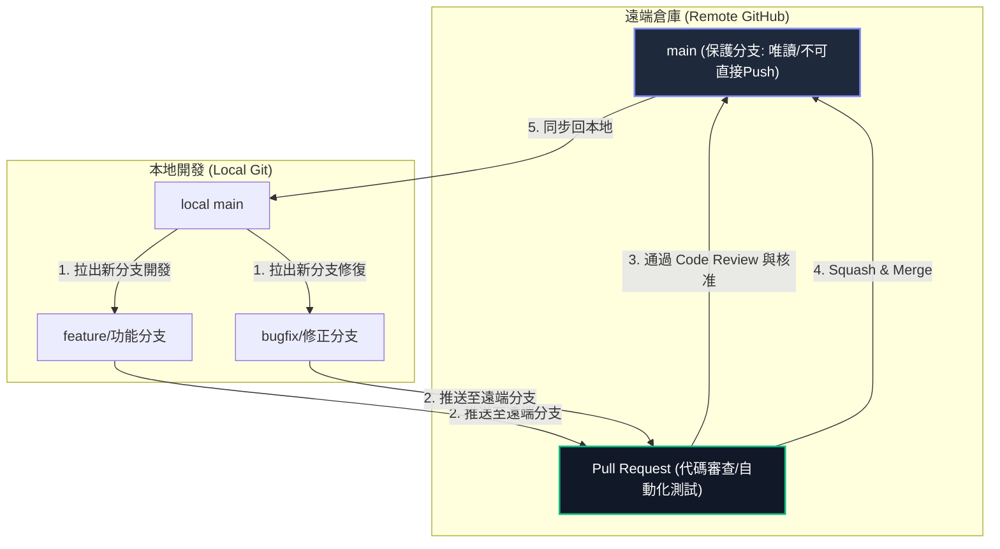

# DE Multi-Track Stego Player & Packer Suite
## 基於無損預測誤差擴張 (PEE) 的多音軌影音隱寫播放與封裝套件

本專案是一套基於 **可逆資料隱寫 (Reversible Data Hiding, RDH)** 與 **預測誤差擴張 (Prediction Error Expansion, PEE)** 技術的數位藏密軟體套件。系統能夠將多個獨立的音訊軌道（如多國語系配音）無損地隱藏在單一 H.265 (HEVC) 影片的像素預測誤差中。播放時，系統利用 Numba JIT 加速引擎即時自影像幀中提取音軌並進行多聲道同步播放，同時實現影片畫面的 **100% 位元級完美還原 (Bit-Perfect Reversibility)**。

---

## 📂 專案目錄架構

為了保持版本控制代碼的潔淨，專案只保留核心功能程式碼與建置腳本。其餘本地測試所需的大型測試影片與暫存檔案皆已配置於 `.gitignore` 排除，不納入代碼庫中。

```
DE/
├── src/                        # 核心功能程式碼
│   ├── download_app.py         # MultiAudioDownloader (多音軌多語系影片下載 GUI)
│   ├── embed_app.py            # StegoPacker (多音軌 PEE 隱寫封裝 GUI)
│   ├── player_app.py           # StegoPlayer (即時解密多音軌播放器 GUI，含科技感儀表板)
│   ├── pee_stego.py            # PEE Steganography 核心演算法庫 (Numba 加速)
│   └── pyinstaller_utils.py    # PyInstaller 打包路徑與可移植性工具
│
├── MultiAudioDownloader.spec   # 多音軌下載器的 PyInstaller 打包設定檔
├── StegoPacker.spec            # 封裝器的 PyInstaller 打包設定檔
├── StegoPlayer.spec            # 播放器的 PyInstaller 打包設定檔
├── build.bat                   # Windows 平台下一鍵打包 Executable 執行檔腳本
├── requirements.txt            # 專案依賴套件清單
├── .gitignore                  # Git 排除清單 (防止大型影片與編譯快取上傳)
└── README.md                   # 專案說明文件 (本檔案)
```

---

## 🛠️ 開發環境建置

### 1. 安裝 Python 依賴
本專案開發測試基於 **Python 3.10+** (推薦使用 3.11 或 3.12)。請在您的虛擬環境下執行：
```bash
pip install -r requirements.txt
```

### 2. 執行應用程式
*   **啟動下載器**：`python src/download_app.py`
*   **啟動封裝器**：`python src/embed_app.py`
*   **啟動播放器**：`python src/player_app.py`

---

## 📝 專案開發規範

為確保專案程式碼的質量與多人口維護的流暢度，請所有編輯者遵守以下規範：

### 1. 程式碼風格與註解
*   遵循 **PEP 8** 程式碼風格指南。
*   所有底層影像與矩陣運算必須使用 **Numba JIT (`@njit(nogil=True, cache=True)`)** 進行加速，並確保傳入的矩陣類型與形狀（如 `np.int16`, `np.uint8`）定義明確，避免 JIT 編譯失敗。
*   **嚴禁刪除任何現有註解或文件**，修改現有代碼時，必須完整保留與該更動無關的既有註解。

### 2. 檔案管理規範 (防範爆庫)
*   **嚴禁提交大型影音檔案與編譯產物**：本系統測試用的影片動輒數 GB，GitHub 限制單一檔案不得超過 100MB。任何影片格式（如 `.mp4`, `.webm`, `.mkv`）、壓縮包（`.zip`）以及編譯快取與產物（`build/`, `dist/`, `.numba_cache/`）皆已在 `.gitignore` 中過濾，切勿強行提交。
*   任何個人實驗性、測試性的臨時腳本，請勿加入 Git 版本控制中。

---

## 🌿 Git 分支與 Push 合併規則 (主線保護機制)

為確保 `main` 主線分支的穩定性，防止未經驗證的代碼被隨意合併導致系統崩潰，本專案在 GitHub 上實施嚴格的**主線保護機制**與**分支工作流**。

### 1. Git 分支與 PR 流程圖



### 2. 分支命名與用途規範

*   **`main` 分支**：生產與發布的主線分支。僅接受通過審查的 Pull Request 合併，**嚴禁任何開發者直接 Push 至此分支**。
*   **`feature/*` 分支**：新功能開發分支。命名範例：`feature/extract-dashboard`、`feature/compatibility-patch`。
*   **`bugfix/*` 分支**：Bug 修復分支。命名範例：`bugfix/ffmpeg-crash-fix`、`bugfix/sync-drift`。

### 3. Commit Message 格式規範 (Angular 規範)

為便於版本歷史追踪與自動化日誌生成，Commit 說明必須採用以下格式：
`類型(影響範圍): 簡短描述`

*   `feat`: 新增功能 (例如 `feat(player): add tech-style real-time log terminal`)
*   `fix`: 修復錯誤 (例如 `fix(stego): fix uint8 luma overflow during expansion`)
*   `docs`: 文件異動 (例如 `docs(readme): detailed code review specs`)
*   `style`: 代碼格式調整 (不影響邏輯，例如 `style(player): reformat PySide layout margins`)
*   `refactor`: 重構代碼 (例如 `refactor(utils): simplify path resolution logic`)
*   `perf`: 效能優化 (例如 `perf(numba): pre-allocate extraction bit buffer`)

---

## 🔍 Pull Request & Code Review 審查細則

所有合併至 `main` 分支的 PR，審查者 (Reviewer) 必須針對以下細節進行嚴格審查：

### 1. PEE 隱寫安全性與防溢位審查
*   **防溢位轉型**：在計算預測誤差 $e = p - \hat{p}$ 前，必須確認像素值已轉型為 `np.int16` 或 `np.int32`，嚴禁使用 `np.uint8` 直接運算，避免負數溢位。
*   **像素截斷 (Clipping)**：嵌入完成後的像素寫回暫存區時，必須使用 `np.clip(G, 0, 255)` 或等效防溢位邊界判定，確保數值不會超出 $0 \sim 255$。
*   **逆向無損驗證**：任何修改演算法邏輯的變更，必須在本地使用 MD5 驗證原始影片與提取還原後的影片是否 100% 相同。

### 2. 效能與資源管理審查
*   **Numba 靜態加速**：確保所有核心的影像逐像素遍歷函數（如 `pee_embed_core_numba`）皆有 `@njit(nogil=True, cache=True)` 裝飾器，且未調用無法被 Numba 編譯的 Python 原生 API。
*   **執行緒隔離**：耗時的 FFmpeg 解碼與隱寫資料提取操作，必須運行在 `QThread` 之中，**嚴禁**在 PySide6 的 GUI 主執行緒中執行阻塞性高的運算，避免介面卡死。
*   **暫存目錄清理**：程序結束或切換影片時，必須觸發 `cleanup_temp_dir()` 釋放寫入作業系統臨時目錄下的 AAC 音軌暫存檔，防止開發者的硬碟空間被暫存檔塞滿。

---

## 🔒 GitHub 倉庫分支保護設定指南 (管理員必讀)

專案管理員請依照以下步驟設定 GitHub，以強制啟用上述保護規範：

1.  進入 GitHub 專案首頁，點擊右上角 **⚙️ Settings**。
2.  在左側選單點擊 **Branches**。
3.  在 *Branch protection rules* 下，點擊 **Add branch rule**。
4.  在 *Branch name pattern* 輸入 `main`。
5.  勾選 **Require a pull request before merging**：
    *   將 **Require approvals** 設定為 `1`（需要至少一人審查通過）。
    *   勾選 **Dismiss stale pull request approvals when new commits are pushed**（有新 Commit 時自動重置 Approve 狀態）。
6.  勾選 **Require conversation resolution before merging**（必須解決所有程式碼討論留言才能合併）。
7.  勾選 **Do not allow bypassing the above settings** (或 **Include administrators**)。
    *   *註：這點最關鍵，它能防止專案擁有者不小心繞過 PR 機制直接 Push 主線。*
8.  點擊下方 **Create** 保存規則。