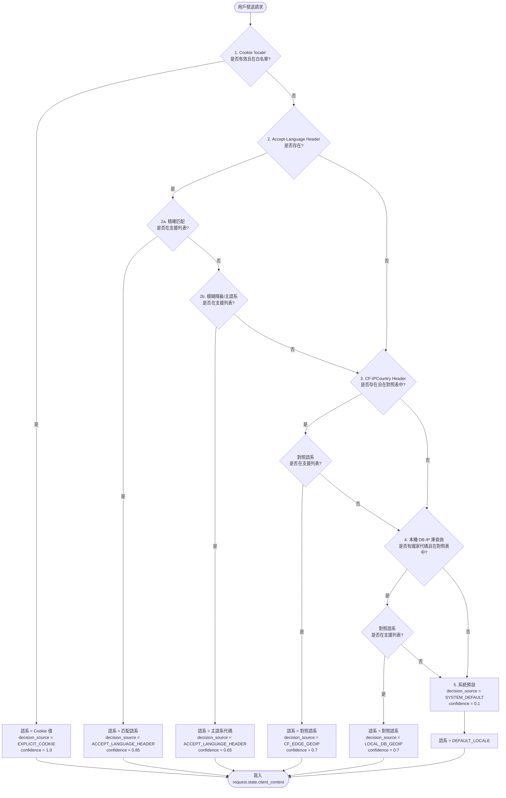

# 🌍 Smart i18n & IP Context Security Module

[](https://fastapi.tiangolo.com/)
[](https://en.wikipedia.org/wiki/Zero_trust_security_model)
[]()
[]()
[](https://creativecommons.org/licenses/by/4.0/)

這是一個為 FastAPI 設計的高內聚、低耦合「隨插即用」安全中介軟體模組。本模組旨在透過**零信任網路邊界校驗**與**黃金語系降級決策樹**，精準判定使用者的真實 IP 與最適顯示語系，徹底阻絕 IP 偽造攻擊（IP Spoofing），並透過「Cloudflare + DB-IP」架構達成 100% 零營運成本。

> ⚠️ **法務與授權注意：** 本模組預設使用 DB-IP Lite 作為離線兜底資料庫。該資料庫採 [CC BY 4.0 授權](https://creativecommons.org/licenses/by/4.0/)，**商業專案前端頁面或 Footer 必須包含署名：**
> ```
> IP Geolocation by DB-IP
> ```

---

## 📑 目錄

1. [架構與目錄結構](#-架構與目錄結構)
2. [核心防禦機制：反向 IP 查驗](#-核心防禦機制反向-ip-查驗)
3. [部署拓樸與反向代理設定](#-部署拓樸與反向代理設定)
4. [智慧語系決策樹](#-智慧語系決策樹-fallback-pipeline)
5. [團隊整合與快速起步](#-團隊整合與快速起步)
6. [模組輸出結構與資料字典](#-模組輸出結構與資料字典)
7. [自動化維運與 Fail-Closed 機制](#-自動化維運與-fail-closed-機制)
8. [紅隊資安測試指南](#-紅隊資安測試指南)

---

## 📂 架構與目錄結構

本專案採「模組化封裝（Black-box Encapsulation）」設計，無副作用，不會污染全域變數或原始 Request Headers。請將 `i18n_security` 整包資料夾放入您的 FastAPI 主專案目錄中：

```text
your_team_project/
├── main.py                    # 主程式入口
├── routers/                   # 業務 API
└── i18n_security/             # 🛡️ 本安全模組 (完全解耦)
    ├── __init__.py            # 模組輸出點 (Middleware, Schemas)
    ├── middleware.py          # 核心防偽造與語系判定邏輯
    ├── schemas.py             # Context 資料結構定義 (Pydantic v2)
    ├── update_assets.py       # 免費資產更新腳本 (CF IP & DB-IP)
    └── data/                  # 存放 dbip-city-lite.mmdb (已加入 .gitignore)
```

---

## 🛡️ 核心防禦機制：反向 IP 查驗 (Anti-IP Spoofing)

本模組原生支援 **IPv4 / IPv6 雙棧解析**。針對不同的反向代理環境，採取雙軌防禦策略：

### 第一軌：Cloudflare 快速通道（優先）

若請求的 Peer IP 屬於 CF 信任網段，系統直接讀取 `CF-Connecting-IP` Header 獲取真實客戶端 IP。這是最安全且效能最高的做法，由 Cloudflare 邊緣節點直接注入，無法被客戶端偽造。

### 第二軌：XFF 右至左反向查驗（兜底防偽造）

針對非 CF 環境（如自建 Nginx / ALB），系統啟動時載入 CIDR 白名單。將 `X-Forwarded-For` 的各節點與底層 Peer IP 串接成完整鏈路，從**最靠近伺服器的節點向左**逐一檢查。遇到第一個「不在白名單內」的 IP 時，立即認定為真實 Client IP 並截斷，徹底無視更左側由惡意用戶構造的假 IP。

> **Peer IP 取得方式：** 在 FastAPI/uvicorn 中為 `request.client.host`。在 Docker bridge 或 Kubernetes 環境下，此值可能是內部節點 IP，需將其加入 `TRUSTED_PROXIES`（詳見[部署拓樸](#-部署拓樸與反向代理設定)章節）。

### `X-Real-IP` 的處理

本模組**不主動讀取** `X-Real-IP`。若 Nginx 設定了此 Header，請注意它僅供其他應用程式使用；本模組的防偽造鏈以 `CF-Connecting-IP` 和 XFF 為準。Nginx 配置範例中保留此設定僅為慣例，不影響本模組行為。

---

## 🌐 部署拓樸與反向代理設定

> 🚨 **容器化環境警告：** 在 Docker 或 Kubernetes 環境下，`request.client.host` 通常是內部 Bridge IP（如 `172.17.x.x`）或 Ingress 節點 IP。**必須**將這些內部網段加入 `TRUSTED_PROXIES`，否則防偽造鏈會在內部節點處提早截斷，導致取得的「真實 IP」實際上是 Ingress IP 而非用戶 IP。

### 情境一：Cloudflare + FastAPI（推薦）

```
用戶 → Cloudflare Edge → FastAPI
```

無需額外設定。模組自動識別 CF 網段並讀取 `CF-Connecting-IP`。`TRUSTED_PROXIES` 由 `update_assets.py` 自動維護。

### 情境二：Nginx 反向代理（無 Cloudflare）

```
用戶 → Nginx → FastAPI
```

Nginx 設定範例（關鍵：使用 `$proxy_add_x_forwarded_for` 附加而非覆蓋）：

```nginx
location / {
    proxy_set_header Host              $host;
    proxy_set_header X-Real-IP         $remote_addr;
    proxy_set_header X-Forwarded-For   $proxy_add_x_forwarded_for;
    proxy_pass http://fastapi_backend;
}
```

`.env` 設定範例：

```ini
# Nginx 伺服器的 IP 或網段
TRUSTED_PROXIES=192.168.1.10/32,10.0.0.0/8,127.0.0.1/32
DEFAULT_LOCALE=en
```

### 情境三：Kubernetes Ingress + FastAPI

```
用戶 → K8s Ingress → Pod (FastAPI)
```

`.env` 設定範例（需包含 Pod 內部網段與 Ingress CIDR）：

```ini
TRUSTED_PROXIES=10.0.0.0/8,172.16.0.0/12,192.168.0.0/16,127.0.0.1/32
DEFAULT_LOCALE=en
```

---

## 🎯 智慧語系決策樹 (Fallback Pipeline)

支援語系：`en`、`zh`、`fr`、`es`、`ar`。處理請求時，嚴格依序執行以下降級邏輯：

| 優先級 | 來源 | `decision_source` | `confidence_score` | 說明 |
|--------|------|-------------------|--------------------|------|
| 1 | Cookie `locale` | `EXPLICIT_COOKIE` | `1.0` | 用戶手動設定，絕對意圖 |
| 2a | `Accept-Language`（精確匹配） | `ACCEPT_LANGUAGE_HEADER` | `0.85` | 依 q-value 排序，`zh` 對上 `zh` |
| 2b | `Accept-Language`（模糊降級） | `ACCEPT_LANGUAGE_HEADER` | `0.65` | `zh-TW` 降級匹配至 `zh` |
| 3 | `CF-IPCountry` Header | `CF_EDGE_GEOIP` | `0.7` | CF 邊緣 GeoIP，零 I/O 成本 |
| 4 | DB-IP Lite `.mmdb` | `LOCAL_DB_GEOIP` | `0.7` | 本機離線查表，開發環境兜底 |
| 5 | 無法匹配 | `SYSTEM_DEFAULT` | `0.1` | 強制降級至 `DEFAULT_LOCALE` |

**Cookie 安全性：** Cookie `locale` 的值在讀取後會以 supported locales 白名單進行驗證。任何不在白名單內的值（包含 SQL injection 嘗試、亂碼字串等）均視為無效，直接 fallback 至下一優先級。

> **業務端提示：** `confidence_score < 0.7` 時，可考慮在畫面上顯示「是否切換為您所在地區的語言？」的提示，讓用戶確認語系偏好。

#### 📊 決策流程圖



---

## 🚀 團隊整合與快速起步

### 1. 安裝相依套件

```
fastapi>=0.100.0
pydantic>=2.0.0
maxminddb>=2.2.0
requests>=2.31.0
```

### 2. 初始化資料庫與安全資產（首次部署必做）

本模組預設使用 DB-IP Lite 做為離線 GeoIP 庫，為避免 Git 儲存庫過於臃腫，`.mmdb` 資料庫已列入 `.gitignore`。

將 `i18n_security` 資料夾複製入您的專案後，**必須在專案根目錄下執行一次資產下載腳本**，以獲取最新的 Cloudflare IP 列表與本地 GeoIP 數據庫：

```bash
# 在您的專案根目錄下執行
python i18n_security/update_assets.py
```

> [!IMPORTANT]
> 首次部署若未執行此步驟，中介軟體仍能安全啟動（Fail-Closed 機制），但 IP 偽造檢查的 Cloudflare 信任通道以及地理定位將因缺少資產檔案而無法發揮作用。

### 3. 環境變數設定（`.env`）

```ini
# 受信任的代理伺服器網段（支援 CIDR，逗號分隔）
# Cloudflare 網段由 update_assets.py 自動維護；非 CF 環境請手動填寫
TRUSTED_PROXIES=103.21.244.0/22,10.0.0.0/8,127.0.0.1/32

# 預設終極兜底語系
DEFAULT_LOCALE=en
```

### 4. 在 FastAPI 中掛載 Middleware

```python
from fastapi import FastAPI
from i18n_security import SmartClientContextMiddleware

app = FastAPI()

SUPPORTED_LOCALES = ["zh", "en", "fr", "es", "ar"]  # list[str]，順序不影響優先級

app.add_middleware(
    SmartClientContextMiddleware,
    supported_locales=SUPPORTED_LOCALES
    # TRUSTED_PROXIES 與 DEFAULT_LOCALE 由模組自動讀取 .env
)
```

> **型別說明：** `supported_locales` 接受 `list[str]`，值必須為小寫 BCP 47 語言標籤（如 `"zh"`、`"en"`）。傳入不合法值時，模組將在 startup 階段拋出 `ValueError`，不會靜默 fallback。

### 5. 前端串接指引（手機裝置真實時區傳遞）

由於標準 HTTP 協定本身不附帶時區，若要精準取得手機用戶的真實時區與本地時間，前端（Web/App）在向 FastAPI 發送請求時，應自動在 Header 中帶入 **`X-Client-Timezone`**。

#### 💻 Web 端 (JavaScript) 範例：
```javascript
// 取得用戶瀏覽器系統時區 (例如 "Asia/Taipei")
const userTimezone = Intl.DateTimeFormat().resolvedOptions().timeZone;

// 在 Axios 請求中加入自訂 Header
axios.get('/api/my-profile', {
    headers: {
        'X-Client-Timezone': userTimezone
    }
});
```

#### 📱 Mobile App 端 (Flutter) 範例：
```dart
import 'package:flutter_timezone/flutter_timezone.dart';

// 取得手機目前的真實時區
final String currentTimeZone = await FlutterTimezone.getLocalTimezone();

// 發送 API 請求時帶入時區 Header
final response = await dio.get(
  '/api/my-profile',
  options: Options(
    headers: {'X-Client-Timezone': currentTimeZone},
  ),
);
```

> [!TIP]
> 當後端中介軟體偵測到 `X-Client-Timezone` Header 時，會將其作為**最高優先級的時區判定依據**，自動覆蓋地理定位的模糊猜測，並寫入 `ctx.geo.timezone`。

---

## 📦 模組輸出結構與資料字典

本模組不修改任何原始 Request，而是將驗證並解析完畢的安全資料注入 `request.state.client_context`。

### 使用範例

```python
from fastapi import APIRouter, Request
from i18n_security.schemas import ClientContext

router = APIRouter()

@router.get("/my-profile")
async def get_profile(request: Request):
    ctx: ClientContext = request.state.client_context

    user_lang = ctx.i18n.detected_locale  # 永遠是安全且支援的語系（如 "zh"）
    user_ip   = ctx.client.ip             # 防偽造後的真實用戶 IP

    return {
        "msg": f"歡迎，您的語系為 {user_lang}，來自 {user_ip}",
        "debug_info": ctx.model_dump()
    }
```

### ClientContext JSON 結構

```json
{
  "client": {
    "ip": "203.0.113.45",
    "is_proxy_detected": true,
    "proxy_type": "Cloudflare"
  },
  "i18n": {
    "detected_locale": "zh",
    "decision_source": "ACCEPT_LANGUAGE_HEADER",
    "confidence_score": 0.85
  },
  "geo": {
    "country_code": "TW",
    "timezone": "Asia/Taipei"
  }
}
```

> **`client.ip` 在 Fail-Closed 情境下的行為：** 若 CF 白名單嚴重過期且 XFF 鏈無法正確解析，系統將回傳 Peer IP（即 `request.client.host`）作為 `client.ip`，並將 `is_proxy_detected` 設為 `false`。此時 IP 精準度下降，但不會回傳 `null` 或拋出例外，服務維持可用。

### 資料字典

**`decision_source` 可能的值：**

| 值 | 觸發條件 |
|----|----------|
| `EXPLICIT_COOKIE` | 用戶手動設定的 Cookie `locale`，且值在白名單內 |
| `ACCEPT_LANGUAGE_HEADER` | 瀏覽器 Header 解析成功，含精確與模糊降級匹配 |
| `CF_EDGE_GEOIP` | 透過 `CF-IPCountry` 推斷（需 CF 環境） |
| `LOCAL_DB_GEOIP` | 透過本機 DB-IP Lite `.mmdb` 推斷 |
| `SYSTEM_DEFAULT` | 以上均無法匹配，回傳 `DEFAULT_LOCALE` |

**`proxy_type` 可能的值：** `"Cloudflare"`、`"Generic"`、`null`（直連）

---

## 🛠️ 自動化維運與 Fail-Closed 機制

模組內建 `update_assets.py`，建議每月執行一次，自動取得最新 Cloudflare IP 網段與 DB-IP Lite 資料庫：

```bash
# 每月 1 號凌晨 3 點自動執行
0 3 1 * * cd /path/to/project/i18n_security && python update_assets.py
```

### Fail-Closed 安全策略

| 失敗情境 | 系統行為 |
|----------|----------|
| 網路錯誤導致 CF IP 列表更新失敗 | 保留現有 `.env` 白名單，不清空，不中斷服務 |
| 損毀或不完整的 `.mmdb` 下載 | 保留現有資料庫，捨棄本次下載 |
| CF 白名單嚴重過期，新 CF 節點無法辨識 | 退回 XFF 解析；`client.ip` 回傳 Peer IP，`is_proxy_detected` 設為 `false` |
| `.mmdb` 完全不存在（首次部署未初始化） | 跳過第四優先級，直接 fallback 至 `SYSTEM_DEFAULT` |

---

## 🧪 紅隊資安測試指南 (Red Team QA)

整合完畢後，請確保系統通過以下極端情境測試：

### TC-01：直接 IP 偽造（無 CDN）

```
X-Forwarded-For: 8.8.8.8
```

**預期：** `ctx.client.ip` 顯示出口真實 IP，`8.8.8.8` 被丟棄。

### TC-02：深度偽造（含合法 CF IP）

```
X-Forwarded-For: 1.1.1.1, 103.21.244.1, <你的真實IP>
```

**預期：** 演算法在 `<你的真實IP>` 截斷，不被左側的 `1.1.1.1` 欺騙。

### TC-03：IPv6 偽造

```
X-Forwarded-For: ::ffff:8.8.8.8, 2400:cb00::1, <真實IPv6>
```

**預期：** IPv6 格式的偽造 IP 同樣被過濾，`ctx.client.ip` 回傳真實 IPv6 位址。

### TC-04：ReDoS / Header 注入

```
Accept-Language: '; DROP TABLE users;-- , <超長亂碼字串>
```

**預期：** 系統穩定運行，`ctx.i18n.detected_locale` 安全 fallback 至 `en`，`decision_source` 為 `SYSTEM_DEFAULT`。

### TC-05：無效 Cookie locale

```
Cookie: locale='; DROP TABLE users;--
Cookie: locale=xx-INVALID
Cookie: locale=
```

**預期：** 三種情境均視為無效，fallback 至 Accept-Language，`decision_source` 不為 `EXPLICIT_COOKIE`。

### TC-06：X-Real-IP 偽造嘗試

```
X-Real-IP: 8.8.8.8
```

**預期：** 模組忽略此 Header，`ctx.client.ip` 不受影響。

### TC-07：空白 / 格式錯誤的 XFF

```
X-Forwarded-For: (空值)
X-Forwarded-For: not-an-ip, also-not-an-ip
```

**預期：** 解析失敗時 fallback 至 Peer IP，服務不中斷，不拋出 500。

---

*Architected for strict security boundaries and seamless team integration.*
